#       SELinux

#   1. Домашнее задание по SELinux

**Задание:**

      1. Запустить nginx на нестандартном порту 3-мя разными способами:
        - переключатели setsebool;
        - добавление нестандартного порта в имеющийся тип;
        - формирование и установка модуля SELinux.
      К сдаче:
      README с описанием каждого решения (скриншоты и демонстрация приветствуются).
      2. Обеспечить работоспособность приложения при включенном selinux.
         - Развернуть приложенный стенд https://github.com/mbfx/otus-linux-adm/tree/master/selinux_dns_problems
         - Выяснить причину неработоспособности механизма обновления зоны (см. README);
         - Предложить решение (или решения) для данной проблемы;
         - Выбрать одно из решений для реализации, предварительно обосновав выбор;
___

**Решение:**

# ДЗ часть 1 работа с nginx

1. Редактируем конфиг файл nginx для запуска на нестандартном порту 8008:

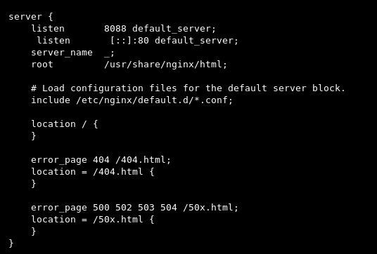

2. Запуск и ошибка nginx, SELinux предотвратил попытку запуска nginx-a на порту не включёному в разрешённые для работы nginx (порт 8088)

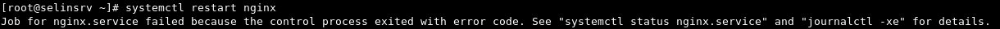

3. systemd который контролирует старт демона nginx, предлагает запустить journalctl -xe, для просмотра журнала запуска nginx-a. При выполнении этой команды (journalctl -xe) получаем отчёт об ошибке, где включены возможные решения данной проблемы с SELinux.

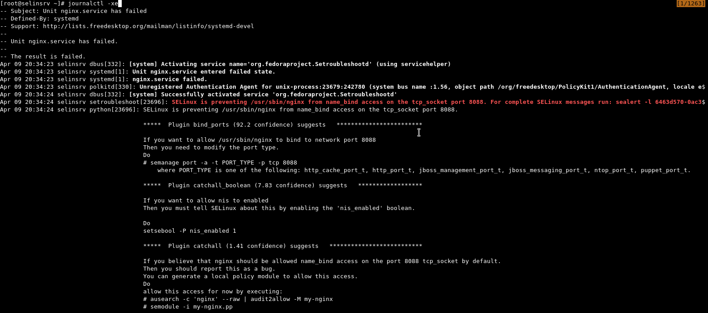

Эти же решения можно получить выполнением команды:

      sealert -a /var/log/audit/audit.log

  
  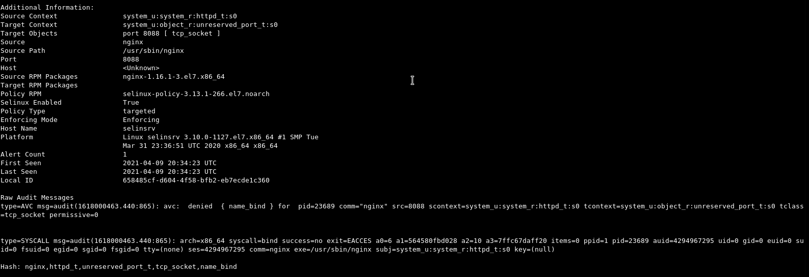

4. Разрешаем запуск nginx, устанавливая булевый переключатель nis_enabled в 1 (режим вкл)

    setsebool -P nis_enabled 1

Пробуем запустить nginx:

  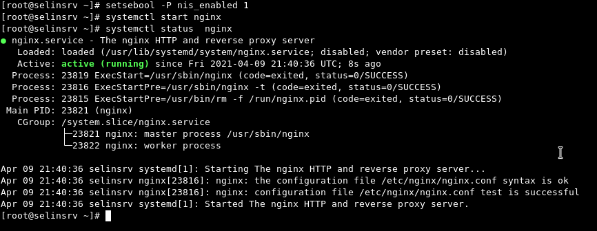

Всё работает !!!

Возвращаем значение nis_enabled в 0 (режим выкл)

      setsebool -P nis_enabled 0

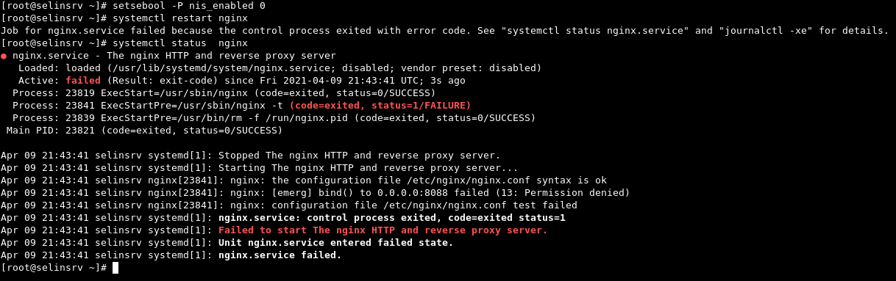

___

5. Разрешаем запуск nginx, включая нестандартный порт в список разрешённых поротов для нужного типа (http_port_t). Этот вариант является предпочтительным для такого запуска nginx-a. В пункте 4, с помощью setbool мы разрешили запуск сервиса на любом порту не управляемом selinux (type unreserved_port_t : class tcp_socket ).

      require {                                                        
              type httpd_t;                                                                
              type unreserved_port_t;                                                         
              class tcp_socket name_bind;                                                                    
      }

Включаем порт в разрешённые для запуска nginx

      semanage port -a -t  http_port_t -p tcp 8088

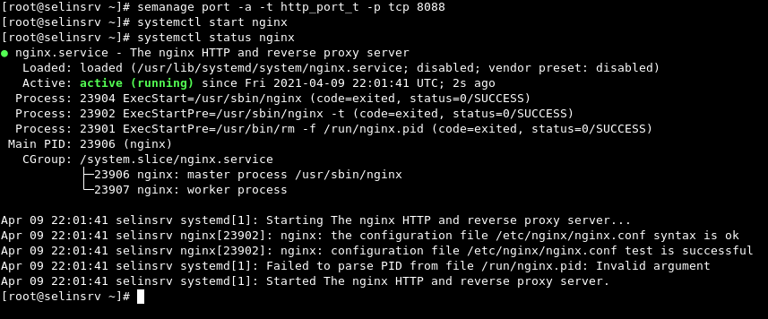

Всё работает !!!

___

6. Разрешаем запуск nginx, используя утилиту audit2allow, для подготовки и генерации модуля, для включения подготовленного модуля с разрешающими правилами в ядро. Это соответствует, пункту 4 (setsebool -P nis_enabled 1) только тут подготовливаетя отдельный модуль с включенными разрешениями. Предварительно удалим порт из разрешённых:

      semanage port -d -t http_port_t -p tcp 8088

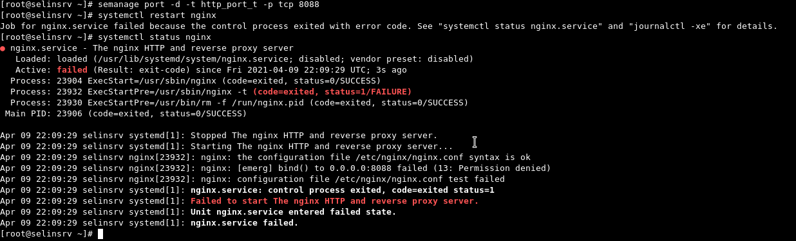

Запускаем утилиту для генерации модуля и последующего включения его в ядро. Немного отличающаяся команда, от предоставленной sealert:

      audit2allow -M nginx_8088 --debug < /var/log/audit/audit.log

ключь --debug говорит содать файл с исходником (nginx_8088.te) модуля nginx_8088.pp

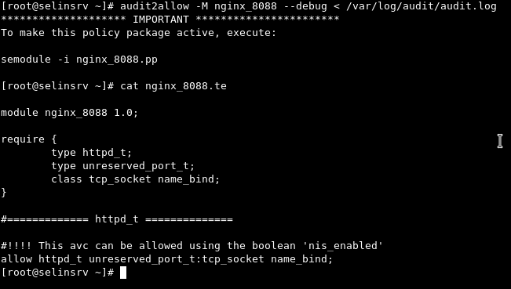

Следующей командой встраиваем модуль в ядро, и запускаем nginx:

      semodule -i nginx_8088.pp

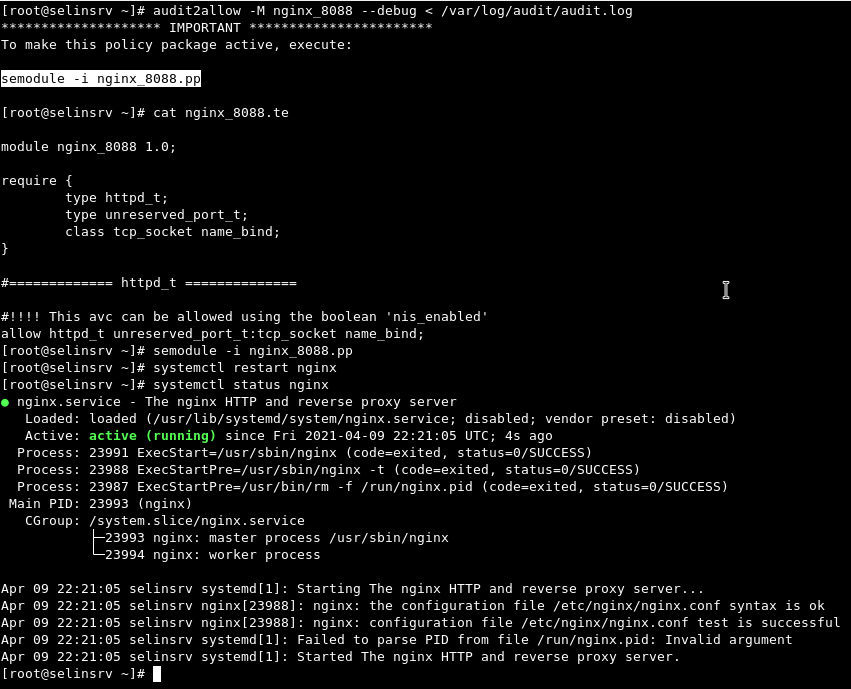

Всё работает !!!

___

# ДЗ часть 2 работа со стендом dns (named)

При запуске команды обновления зоны получаем ошибку - **update failed: SERVFAIL:**

[vagrant@client ~]$ nsupdate -k /etc/named.zonetransfer.key
      \> server 192.168.50.10
      \> zone ddns.lab
      \> update add www.ddns.lab. 60 A 192.168.50.15
      \> send
      **pdate failed: SERVFAIL**

    
Вывод запуска команды sealert -a  на сервере ns01

        [root@ns01 ~]# sealert -a /var/log/audit/audit.log
        100% done
        found 1 alerts in /var/log/audit/audit.log
        --------------------------------------------------------------------------------

        SELinux is preventing /usr/sbin/named from create access on the file named.ddns.lab.view1.jnl.

        *****  Plugin catchall_labels (83.8 confidence) suggests   *******************

        If you want to allow named to have create access on the named.ddns.lab.view1.jnl file
        Then you need to change the label on named.ddns.lab.view1.jnl
        Do
        # semanage fcontext -a -t FILE_TYPE 'named.ddns.lab.view1.jnl'
        where FILE_TYPE is one of the following: dnssec_trigger_var_run_t, ipa_var_lib_t, krb5_host_rcache_t, krb5_keytab_t, named_cache_t, named_log_t, named_tmp_t, named_var_run_t, named_zone_t.
        Then execute:
        restorecon -v 'named.ddns.lab.view1.jnl'

        *****  Plugin catchall (17.1 confidence) suggests   **************************

        If you believe that named should be allowed create access on the named.ddns.lab.view1.jnl file by default.
        Then you should report this as a bug.
        You can generate a local policy module to allow this access.
        Do
        allow this access for now by executing:
        # ausearch -c 'isc-worker0000' --raw | audit2allow -M my-iscworker0000
        # semodule -i my-iscworker0000.pp

        Additional Information:
        Source Context                system_u:system_r:named_t:s0
        Target Context                system_u:object_r:etc_t:s0
        Target Objects                named.ddns.lab.view1.jnl [ file ]
        Source                        isc-worker0000
        Source Path                   /usr/sbin/named
        Port                          <Unknown>
        Host                          <Unknown>
        Source RPM Packages           bind-9.11.4-26.P2.el7_9.4.x86_64
        Target RPM Packages
        Policy RPM                    selinux-policy-3.13.1-266.el7.noarch
        Selinux Enabled               True
        Policy Type                   targeted
        Enforcing Mode                Enforcing
        Host Name                     ns01
        Platform                      Linux ns01 3.10.0-1127.el7.x86_64 #1 SMP Tue Mar
        31 23:36:51 UTC 2020 x86_64 x86_64
        Alert Count                   1
        First Seen                    2021-04-12 09:47:46 UTC
        Last Seen                     2021-04-12 09:47:46 UTC
        Local ID                      4a3e7a80-8053-4602-aa5a-1d3682689a32

        Raw Audit Messages

        type=AVC msg=audit(1618220866.495:1981): avc:  denied  { create } for  pid=5262 comm="isc-worker0000" name="named.ddns.lab.view1.jnl" scontext=system_u:system_r:named_t:s0 tcontext=system_u:object_r:etc_t:s0 tclass=file permissive=0

        type=SYSCALL msg=audit(1618220866.495:1981): arch=x86_64 syscall=open success=no exit=EACCES a0=7fe65f9d0050 a1=241 a2=1b6 a3=24 items=0 ppid=1 pid=5262 auid=4294967295 uid=25 gid=25 euid=25 suid=25 fsuid=25 egid=25 sgid=25 fsgid=25 tty=(
        none) ses=4294967295 comm=isc-worker0000 exe=/usr/sbin/named subj=system_u:system_r:named_t:s0 key=(null)

        Hash: isc-worker0000,named_t,etc_t,file,create

Можно создать разрешающий можуль, как предагает вывод команды sealert:

      # ausearch -c 'isc-worker0000' --raw | audit2allow -M my-iscworker0000
      # semodule -i my-iscworker0000.pp

но такой подход будет не совсем правильный.

  Установим тип для папки /etc/named/dynamic/ и файлов в значение named_zone_t, что позволит записать файл зоны в данную папку. Такой подход будет более безопастный, чем   создавать модуль с разрешением на запись в файлы помеченные типом etc_t, что даёт теоретическую возможность писать во все файлы в папке /etc/, в частности shadow/passwd файлы.

      Исходный тип на папке "/etc/named/dynamic/""  установлен "etc_t"

      [root@ns01 ~]# ls -Z /etc/named/dynamic/
      -rw-rw----. named named system_u:object_r:etc_t:s0 named.ddns.lab
      -rw-rw----. named named system_u:object_r:etc_t:s0 named.ddns.lab.view1

      chcon -vR -t named_zone_t /etc/named/dynamic/

      После выполнения команды:

      [root@ns01 ~]# ls -Z /etc/named/dynamic/
      -rw-rw----. named named system_u:object_r:named_zone_t:s0 named.ddns.lab
      -rw-rw----. named named system_u:object_r:named_zone_t:s0 named.ddns.lab.view1

      Выполняем перезапуск named демона:

      [root@ns01 ~]#  

      Запускаем на клиенте "client" команду на обновление зоны, и смотрим папку /etc/named/dynamic/

      root@ns01 ~]# ll /etc/named/dynamic/
      total 12
      -rw-rw----. 1 named named 509 Apr 12 09:02 named.ddns.lab
      -rw-rw----. 1 named named 509 Apr 12 09:02 named.ddns.lab.view1
      -rw-r--r--. 1 named named 700 Apr 12 09:59 named.ddns.lab.view1.jnl

Всё работает !!!

#   2.  Общая теория, примеры, полезности.

>**По умолчанию, в RHEL-based дистрибутивах используется основанная на TE и RBAC политика targeted (целевая). Название «целевая» эта политика получила потому, что ограничивает только потенциально уязвимые сервисы, при этом доверенные выполняются в неограниченном домене unconfined_t и не управляются политиками SELinux.**

Ссылки на статьи и документацию:

[Документация по SELinux Fedora Project](https://docs.fedoraproject.org/ru-RU/Fedora/13/html/Security-Enhanced_Linux/index.html)  
[MLS/MCS и TE механизм мандатного управления доступом ](https://defcon.ru/os-security/1264/)  

Общий принцип работы SELinux:  

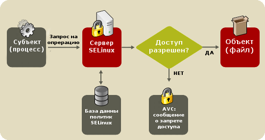

Развёрнутый вариант работы SELinux:
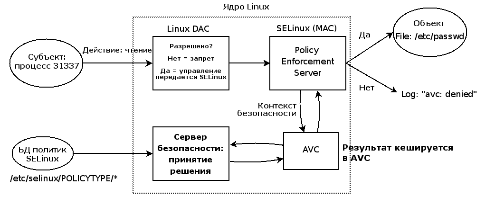

##  2.1 Основные термины, использующиеся в SELinux

- **_Домен_** — список действий, которые может выполнять процесс. Обычно в качестве домена определяется минимально-возможный набор действий, при помощи которых процесс способен функционировать. Таким образом, если процесс дискредитирован, злоумышленнику не удастся нанести большого вреда.

- **_Тип_** — набор действий, которые допустимы по отношения к объекту. Тип отличается от домена тем, что он может применяться к пайпам, каталогам и файлам, в то время как домен применяется к процессам.

- **_Роль_** — список доменов, которые могут быть применены. Если какого-то домена нет в списке доменов какой-то роли, то действия из этого домена не могут быть применены.

- **_Контекст безопасности_** — все атрибуты SELinux — роли, типы и домены.

___

##    2.2 Основные инструменты SELinux

**_Пакет setools-console:_**

  - sesearch
  - seinfo
  - findcon
  - getsebool
  - setsebool

**_Пакет policycoreutils-python:_**

  - audit2allow
  - audit2why
  - semanage

**_Пакет policycoreutils-newrole:_**

  - newrole

**_Пакет setroubleshoot-server:_**

  - sealert
___
#### 2.2.1 Команды управления SELinux

>**Особенности работы:**  
**Если нужно запустить несговорчивое или самосборное приложение - запускать его надо из каталога /opt, в нем SELinux не работает.**

- **_seinfo_** - Утилита получения информации о политике SELinux. Позволяет пользователю опрашивать компоненты политики SELinux.

    seinfo -afile_type -x  - вывести доступные типы файлов.
    seinfo -adomain -x - вывести доступные домены

___

- **_semanage_** - Утилита управления политикой SELinux [man страничка](https://www.opennet.ru/man.shtml?topic=semanage&category=8&russian=0)
Смотрим информацию о правах пользователей:  

    Параметры запуска:  

  1. Определить контекст файлов для всего, расположенного в \/web (потом это определение используется утилитой restorecon):

          $ semanage fcontext -a -t httpd_sys_content_t "/web(/.*)?"

  2.  Список логинов:

            $ semanage login -l

            Имя входа            Пользователь SELinux Диапазон MLS/MCS     Служба
            __default__          unconfined_u         s0-s0:c0.c1023       *
            root                 unconfined_u         s0-s0:c0.c1023       *

  3. Список портов

            $ semanage port -l

            ....
            dns_port_t                     tcp      53
            dns_port_t                     udp      53
            dnssec_port_t                  tcp      8955
            ....

Смотрим контекст безопасности субъекта:

    ls -Z /usr/sbin/nginx                                                                               
    -rwxr-xr-x. root root **system_u:object_r:httpd_exec_t**:s0 /usr/sbin/nginx

Смотрим контекст безопасности процесса:

    ps -Z 940
    LABEL                             PID TTY      STAT   TIME COMMAND
    unconfined_u:unconfined_r:unconfined_t:s0-s0:c0.c1023 940 pts/0 S   0:00 su -l

- **_sealert_** - Используется для анализа логов и вывода сообщений об ошибках доступа. Выводит возможные решения проблемы

Пример запуска программы:

    sealert -a /var/log/audit/audit.log

    
Вывод запуска команды sealert -a 

      found 2 alerts in /var/log/audit/audit.log
      --------------------------------------------------------------------------------

      SELinux is preventing /usr/bin/chcon from using the mac_admin capability.

      *****  Plugin catchall (100. confidence) suggests   **************************

      If you believe that chcon should have the mac_admin capability by default.
      Then you should report this as a bug.
      You can generate a local policy module to allow this access.
      Do
      allow this access for now by executing:
      # ausearch -c 'chcon' --raw | audit2allow -M my-chcon
      # semodule -i my-chcon.pp

      Additional Information:
      Source Context                unconfined_u:unconfined_r:unconfined_t:s0-s0:c0.c1
      023
      Target Context                unconfined_u:unconfined_r:unconfined_t:s0-s0:c0.c1
      023
      Target Objects                Unknown [ capability2 ]
      Source                        chcon
      Source Path                   /usr/bin/chcon
      Port                          <Unknown>
      Host                          <Unknown>
      Source RPM Packages           coreutils-8.22-24.el7.x86_64
      Target RPM Packages
      Policy RPM                    selinux-policy-3.13.1-266.el7.noarch
      Selinux Enabled               True
      Policy Type                   targeted
      Enforcing Mode                Enforcing
      Host Name                     selinsrv
      Platform                      Linux selinsrv 3.10.0-1127.el7.x86_64 #1 SMP Tue
      Mar 31 23:36:51 UTC 2020 x86_64 x86_64
      Alert Count                   2
      First Seen                    2021-04-09 08:51:52 +03
      Last Seen                     2021-04-09 08:57:46 +03
      Local ID                      b60ecd73-9b0a-4023-b3d6-174f32b07916

      Raw Audit Messages
      type=AVC msg=audit(1617947866.849:125): avc:  denied  { mac_admin } for  pid=1296 comm="chcon" capability=33  scontext=unconfined_u:unconfined_r:unconfined_t:s0-s0:c0.c1023 tcontext=unconfined_u:unconfined_r:unconfined_t:s0-s0:c0.c1023 tclass=capability2 permissive=0

      type=SYSCALL msg=audit(1617947866.849:125): arch=x86_64 syscall=setxattr success=no exit=EINVAL a0=239a0e0 a1=7fc8da637f6a a2=239b5b0 a3=1e items=0 ppid=941 pid=1296 auid=1000 uid=0 gid=0 euid=0 suid=0 fsuid=0 egid=0 sgid=0 fsgid=0 tty=pts0 ses=1 comm=chcon exe=/usr/bin/chcon subj=unconfined_u:unconfined_r:unconfined_t:s0-s0:c0.c1023 key=(null)

      Hash: chcon,unconfined_t,unconfined_t,capability2,mac_admin

      --------------------------------------------------------------------------------
      SELinux is preventing /usr/sbin/nginx from name_bind access on the tcp_socket port 4080.

      *****  Plugin bind_ports (92.2 confidence) suggests   ************************

      If you want to allow /usr/sbin/nginx to bind to network port 4080
      Then you need to modify the port type.
      Do
      # semanage port -a -t PORT_TYPE -p tcp 4080
      where PORT_TYPE is one of the following: http_cache_port_t, http_port_t, jboss_management_port_t, jboss_messaging_port_t, ntop_port_t, puppet_port_t.

      *****  Plugin catchall_boolean (7.83 confidence) suggests   ******************

      If you want to allow nis to enabled
      Then you must tell SELinux about this by enabling the 'nis_enabled' boolean.

      Do
      setsebool -P nis_enabled 1

      *****  Plugin catchall (1.41 confidence) suggests   **************************

      If you believe that nginx should be allowed name_bind access on the port 4080 tcp_socket by default.
      Then you should report this as a bug.
      You can generate a local policy module to allow this access.
      Do
      allow this access for now by executing:
      # ausearch -c 'nginx' --raw | audit2allow -M my-nginx
      # semodule -i my-nginx.pp

      Additional Information:
      Source Context                system_u:system_r:httpd_t:s0
      Target Context                system_u:object_r:unreserved_port_t:s0
      Target Objects                port 4080 [ tcp_socket ]
      Source                        nginx
      Source Path                   /usr/sbin/nginx
      Port                          4080
      Host                          <Unknown>
      Source RPM Packages           nginx-1.16.1-3.el7.x86_64
      Target RPM Packages
      Policy RPM                    selinux-policy-3.13.1-266.el7.noarch
      Selinux Enabled               True
      Policy Type                   targeted
      Enforcing Mode                Enforcing
      Host Name                     selinsrv
      Platform                      Linux selinsrv 3.10.0-1127.el7.x86_64 #1 SMP Tue
      Mar 31 23:36:51 UTC 2020 x86_64 x86_64
      Alert Count                   1
      First Seen                    2021-04-09 11:28:07 +03
      Last Seen                     2021-04-09 11:28:07 +03
      Local ID                      42e7b61e-bc6d-48e2-928b-e6d43c0cfce5

      Raw Audit Messages
      type=AVC msg=audit(1617956887.82:150): avc:  denied  { name_bind } for  pid=1581 comm="nginx" src=4080 scontext=system_u:system_r:httpd_t:s0 tcontext=system_u:object_r:unreserved_port_t:s0 tclass=tcp_socket permissive=0
      type=SYSCALL msg=audit(1617956887.82:150): arch=x86_64 syscall=bind success=no exit=EACCES a0=6 a1=558af4da2568 a2=10 a3=7ffc7c64f2e0 items=0 ppid=1 pid=1581 auid=4294967295 uid=0 gid=0 euid=0 suid=0 fsuid=0 egid=0 sgid=0 fsgid=0 tty=(none) ses=4294967295 comm=nginx exe=/usr/sbin/nginx subj=system_u:system_r:httpd_t:s0 key=(null)

      Hash: nginx,httpd_t,unreserved_port_t,tcp_socket,name_bind

- **_sesearch_** - Утилита опроса политики SELinux [man страничка](http://manpages.ubuntu.com/manpages/hirsute/ru/man1/sesearch.1.html)

Пример поиска разрешающих правил для типа httpd_t:

    sesearch -A -s httpd_t | grep 'allow httpd_t'
    .......
    allow httpd_t zarafa_var_lib_t : dir { ioctl read write create getattr setattr lock unlink link rename
    add_name remove_name reparent search rmdir open } ;
    allow httpd_t antivirus_t : process transition ;
    .......

- **_sestatus_** - Узнать в каком режиме работает SELinux:

      [root@selinsrv ~]# sestatus
      SELinux status:                 enabled         <---- SELinux включен
      SELinuxfs mount:                /sys/fs/selinux
      SELinux root directory:         /etc/selinux
      Loaded policy name:             targeted
      Current mode:                   enforcing       <---- В каком режиме работает SELinux на данный момент
      Mode from config file:          enforcing       <---- Режим, в котором будет SELinux после перезагрузки
      Policy MLS status:              enabled
      Policy deny_unknown status:     allowed
      Max kernel policy version:      31

- **_getenforce_** - Узнать в каком режиме работает SELinux:
-
      root@selinsrv ~]# getenforce
      Enforcing                     <---- Статус SELinux

- **_setenforce_** - Изменение режима работы SELinux (включить SELinux - 1, выключить - 0):
-
      setenforce 1

- **_chcon_** - Меняем тип в контексте каталога ( исходный тип - system_u:object_r:**_admin_home_t_**:s0 root):

      chcon -R -t ssh_home_t /root     <---- Установили тип контекста каталога /root на **_ssh_home_t_**

- **_restorecon_** - Восстанавливаем контекст каталога:

      restorecon -v /root

- **_audit2why_** - Определить из сообщения аудита SELinux причину запрета доступа [man страничка](https://www.opennet.ru/man.shtml?topic=audit2allow&category=1&russian=0)

    Смотрим ошибки и рекомендации в audit.log:

        [root@selinsrv ~]# audit2why < /var/log/audit/audit.log

        type=AVC msg=audit(1617947512.378:124): avc:  denied  { mac_admin } for  pid=1238 comm="chcon" capability=33  scontext=unconfined_u:unconfined_r:unconfined_t:s0-s0:c0.c1023 tcontext=unconfined_u:unconfined_r:unconfined_t:s0-s0:c0.c1023 tclass=capability2 permissive=0

- **_audit2allow_** - Создает разрешающие правила политики SELinux из файлов журналов, содержащих сообщения о запрете операций [man страничка](https://www.opennet.ru/man.shtml?topic=audit2allow&category=1&russian=0):

      [root@selinsrv ~]# audit2allow -M httpd_add --debug < /var/log/audit/audit.log

- **_semodule_** - Утилита управления пакетами модулей политики SELinux.[man страничка](https://www.opennet.ru/man.shtml?topic=semodule&category=8&russian=0)

    Загружаем модуль:

      semodule -i httpd_add.pp

- **_ausearch_** -поиск по журналу аудита

    Пример запуска:

      [root@selinsrv ~]# ausearch -c 'nginx' | audit2allow -M prv_nginx  <---- Найти в audit.log строку с проблемой по nginx, и с помощью audit2allow сделать разрешающий модуль.

 ___

Контексты  (то есть политики) уже есть в системе, об этом позаботились создатели дистрибутива и разработчики приложений. Контексты лежат вот по этому пути:

        /etc/selinux/targeted/contexts/files

Параметризованные политики SELinux:

представляют из себя политики, которые описаны переменные с булевым типом (on/off). Управляются утилитами: getsebool и setsebool

- **_getsebool_** -  Просмотр булевых параметров типов в SELinux

      Пример работы:

          [root@selinsrv ~]# getsebool -a | grep zabbix
          httpd_can_connect_zabbix --> off
          zabbix_can_network --> off
          zabbix_run_sudo --> off

- **_setsebool_** - Включение или отключение политики

      Пример работы:

          [root@selinsrv ~]# setsebool -P  zabbix_can_network on

          [root@selinsrv ~]# getsebool -a | grep zabbix
          httpd_can_connect_zabbix --> off
          zabbix_can_network --> on
          zabbix_run_sudo --> off

Как происходит наследование типов в SELinux?
Примерно также, как и все прочие права в Linux - например в случае создания файлов в каталоге, известном определенному контексту, файл наследует тип этого каталога.  
Context transition (переход контекста) может быть инициирован политикой, такими инструментами, как runcon, или с помощью SELinux API.  
Переход Process context (domain) может происходить при наличии трех условий:
- целевой контекст файла является исполняемым для исходного домена
- целевой контекст файла помечен как точка входа для целевого домена
- исходный домен разрешен для перехода в целевой домен
